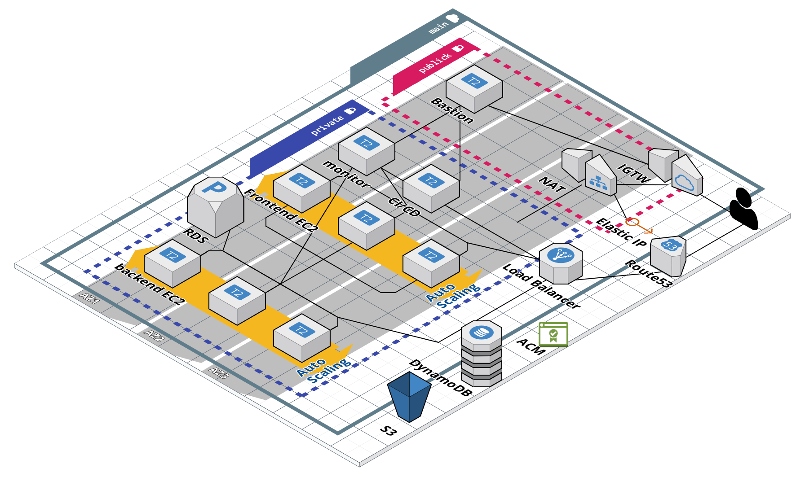

## Infrastructure steps
##### 1 Set your credential
```agsl
export AWS_ACCESS_KEY_ID=D***************K
export AWS_SECRET_ACCESS_KEY=b******************************V
```
or
```
awscli configure
```
##### 2 Set your seting in gitlab variable
_________________________________
### Start in "00_layer_init" folder
##### 1 Set your seting in setting file on progect folder 
```
./progects/dev/00_layer_init/setting.tf
```
##### 2 Use needs tf version
```
tfenv use 1.3.6
```
##### 3 Initialize tf
```
terraform init
```
##### 4 Show workspaces
```
terraform workspace list
```
##### 5 Make new worspace
```
terraform workspace new dev
```
##### 6 Use new worspace
```
terraform workspace select dev
```
##### 7 Planing infrastrukture
```
terraform plan
```
##### 8 Aplay infrastrukture
```
terraform apply
```
##### 9 Up next level and repite needs steps


_________________________________
## **DESTROY INFRASTRUKTURE**
```
terraform destroy
```

_________________________________
### Structure image


_________________________________
### Pipeline image


_________________________________
### Folder structure

```
.
├── modules
│   ├── README.md
│   ├── aws_deploy
│   ├── aws_dynamo_db
│   ├── aws_ec2s
│   ├── aws_network
│   ├── aws_rds
│   ├── aws_s3
│   └── aws_versions
└── projects
    ├── dev
    │   ├── 00_layer_init
    │   ├── 10_layer_network
    │   ├── 20_layer_ec2s
    │   ├── 30_layer_rds
    │   ├── 40_layer_deploy
    │   └── README.md
    ├── prod
    └── stage

46 directories, 91 files
```
### Structure image3d

